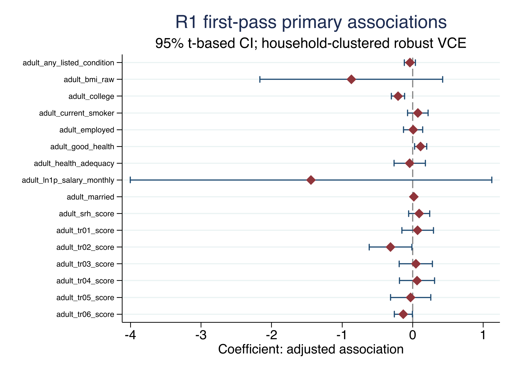

# Maternal International Work Migration and Adult Outcomes among Left-Behind Children in Indonesia

*Anonymised working-paper draft — Riset 1 first-pass release*

## Abstract

This paper studies the association between verified mother-led international
work migration after the first wave of the Indonesia Family Life Survey and
adult outcomes among children who remained in the origin household. The
analysis defines exposure narrowly: the linked mother must have a verified
work-related move to a country outside Indonesia, the child must remain in the
origin household at the event wave, and the baseline parent and household
links must pass quality checks. The primary sample contains 3,847 W1 children
aged 0–12 who are linked to W5 adult outcomes, including 25 treated and 3,822
controls. We estimate unweighted adjusted associations with W1 controls and
origin-household clustered robust standard errors. The largest first-pass
signals are lower college attainment and higher good self-rated health among
treated observations; these are associations, not causal effects. Outcome
support, the small treated cell, selective W5 follow-up, and unresolved survey
design and source-release metadata limit inference. A combined
multidimensional index is not constructed in this release.

**Keywords:** international migration; left-behind children; adult outcomes;
Indonesia; longitudinal survey; social welfare

## 1. Introduction

International work migration can change the resources, care arrangements, and
daily environments experienced by children who remain in the origin household.
Those channels may matter long after the migration episode. The empirical
challenge is that migration is not randomly assigned: households that send a
mother abroad may differ from other households before the move, and a child’s
continued residence or later survey observation may also be selective.

This paper asks a deliberately bounded question: within a quality-controlled
longitudinal sample of Indonesian children, how are verified mother-led
international work migration episodes after the first IFLS wave associated
with separate adult education, labour, health, and social/behavioural outcomes
observed in W5? The paper does not claim to identify a causal migration effect.
It reports a transparent first-pass association that can be audited before a
stronger identification strategy is attempted.

The release makes three choices that narrow the question. First, treatment is
limited to the child’s linked mother and to a destination country that is
verified as outside Indonesia under the wave-specific source rules. Second,
children with ambiguous parent links, contaminated origin-household status, or
incompatible whole-household movement are not silently assigned to the
control group. Third, adult outcomes are kept as separate measures. The
concept note proposed a multidimensional index, but the current files do not
support a validated common index across the relevant outcome modules.

## 2. Data and study population

The Indonesia Family Life Survey (IFLS) is an ongoing longitudinal survey with
repeated waves and information at individual, household, community, and
facility levels. RAND's official study-design and data-notes pages document
the wave structure, record units, tracking guidance, skip patterns, and special
codes; the IFLS5 field report provides additional field documentation (RAND,
2016; RAND, n.d.-a; RAND, n.d.-b; RAND, n.d.-c). RAND's access page requires
registration for public-use data, separates restricted-use access, prohibits
redistribution, and requires acknowledgement of IFLS (RAND, n.d.-d). This
first-pass analysis uses locally held IFLS files and preserves the original
source directory. The exact official source-release identifier and owner
access record remain open and are not inferred from local hashes.

The baseline cohort consists of W1 children aged 0–12. The primary frame
requires both W1 parent links to be valid, a clean W1 origin household, and
the necessary W5 linkage. The final common frame contains 3,847 observations:
25 treated observations and 3,822 controls. The number of observations and
treated cases varies by adult outcome because the model uses outcome-specific
listwise deletion.

### Table 1. R1 sample flow and support

| Stage | N |
|---|---:|
| W1 child cohort aged 0–12 | 9,891 |
| Both parents linked, clean origin, and W5 tracked | 6,046 |
| Mother post-W1 migration evidence observed | 3,952 |
| Verified treated | 25 |
| Observed control | 3,884 |
| R1 analysis frame before outcome-specific deletion | 3,847 |
| Treated / control in common analysis frame | 25 / 3,822 |

The stage counts above are construction-flow counts. They should not be read
as national prevalence estimates.

## 3. Exposure, outcomes, and empirical specification

### 3.1 Treatment definition

An observation is treated only when all of the following conditions hold:

1. the child belongs to the W1 age 0–12 cohort;
2. both baseline parent links and the W1 origin household pass the quality
   rules;
3. the linked mother has an observed post-W1 migration episode or screen;
4. the move has a verified work reason;
5. the destination is verified as outside Indonesia under the relevant wave
   rule;
6. the move occurs after the W1 baseline window;
7. the child remains in the origin household at the event wave; and
8. there is no incompatible whole-household or child-moved evidence.

Domestic migration, father-only migration, any-parent migration without a
verified mother episode, unresolved country codes, commuting, death, and
non-work moves are not part of the primary treatment. Unresolved exposure is
kept as a separate status and is excluded from the primary frame rather than
forced into control.

### 3.2 Adult outcomes

W5 adult outcomes are observed among persons aged 17–36. The primary release
uses separate outcome families: college attainment, employment, log monthly
salary, self-rated health score, good self-rated health, marital status, and
trust-item scores. Binary coefficients are interpreted as percentage-point
associations. Salary is `ln(1 + salary)` within W5; it is not deflated across
waves. Profit is not interpreted for R1 because the model has only four treated
observations and fails the predeclared support gate. The missing W5 `b3b_vg`
module is not presented as a complete CES-D-10 measure.

### 3.3 Model

For each outcome (Y_{i}), the primary specification is:

$$
Y_i = \alpha + \beta T_i + \gamma'X_i + \varepsilon_i,
$$

where (T_i) is the locked migration indicator and (X_i) contains W1 child
age, child sex, household size, and linked mother and father ages. Estimates
are unweighted. Standard errors are robust and clustered at the W1 origin
household. Each outcome has its own valid-code and missingness rule. The
Benjamini–Hochberg adjustment is calculated within the predeclared paper by
outcome-family group.

The coefficient β is an adjusted conditional association. It is not a causal
effect because the design does not establish exchangeability, exogenous
treatment timing, or a valid instrument.

## 4. Results

### 4.1 Headline estimates

Table 2 reports a pre-labelled set of outcome domains. It is not a table made
by selecting only statistically significant results. The complete adjusted
result file contains all estimable outcomes, including the social/behavioural
items and the explicit below-support result status.

\newpage

### Table 2. R1 adjusted associations in the common first-pass frame

The `N / treated` column is outcome-specific after valid-code and listwise
deletion; it is not the common-frame count of 3,847 observations and 25
treated observations.

| Outcome | Estimate | 95% CI | p; BH q | N / treated |
|---|---:|---:|---:|---:|
| College attainment (pp) | -20.74 | [-30.15, -11.33] | <0.001; <0.001 | 3,638 / 22 |
| Employment (pp) | 0.71 | [-12.92, 14.33] | 0.919; 0.919 | 3,655 / 22 |
| Log monthly salary | -1.441 | [-4.002, 1.120] | 0.270; 0.540 | 1,795 / 13 |
| Self-rated health score | 0.092 | [-0.059, 0.242] | 0.232; 0.309 | 3,644 / 23 |
| Good self-rated health (pp) | 11.19 | [2.66, 19.72] | 0.010; 0.041 | 3,644 / 23 |
| Married/cohabiting (pp) | 1.66 | [0.34, 2.97] | 0.014; 0.122 | 2,402 / 19 |
| Trust item 3 score | 0.045 | [-0.191, 0.281] | 0.706; 0.795 | 3,479 / 22 |

The adjusted association with college attainment is -0.207, equivalent to
about 20.7 percentage points in this binary outcome, with a BH q-value below
0.001. The adjusted association with good self-rated health is +0.112, or
about 11.2 percentage points, with q = 0.041. These two signals should not be
read as estimated causal impacts: they can reflect pre-existing household
differences, selective exposure classification, or selective follow-up.

The other headline outcomes do not survive the predeclared q < 0.05 threshold
within their outcome families. The salary estimate has wide uncertainty and a
smaller outcome-specific treated count. The full table should be consulted
before any interpretation of individual social/behavioural items.

### 4.2 Descriptive baseline information

The package includes baseline means and standard deviations by treatment status
in `tables/baseline_descriptives.csv`. They are descriptive within the locked
frame, not balance tests that validate a causal design. The treated group is
small, so baseline comparisons can be driven by a few households and should
not be used to justify causal language.

## 5. Limitations and reviewer-facing boundaries

The first limitation is support. Only 25 observations are treated in the
common frame, and outcome-specific treated counts range from 13 to 23 for the
headline results. The R1 profit outcome has four treated observations and is
withheld from interpretation. This makes the estimates sensitive to individual
households and limits precision.

The second limitation is selection. The sample requires valid baseline parent
links, a clean origin household, successful linkage to W5, and valid values for
each outcome. This is necessary for transparent construction but may select a
non-representative subset. No attrition correction is claimed in this release.

The third limitation is identification. W1 controls reduce measured baseline
differences but do not remove unmeasured differences in migration preferences,
resources, care arrangements, local labour markets, or child characteristics.
No IV, matching, mediation, fixed-effects, or event-study result is part of
the primary release.

The fourth limitation is measurement and provenance. Country coding is kept
wave-specific rather than harmonised by assumption. Unresolved exposure and
lineage statuses are excluded from the primary frame. The local file hashes
are complete, but the exact official release identifier and authorized-data
provenance remain open. Finally, the current release does not construct the
proposed IMDI and does not report a national monetary loss or NPV.

## 6. Conclusion

In the locked IFLS first-pass sample, verified mother-led international work
migration after W1 is associated with lower adult college attainment and
higher good self-rated health after adjustment for measured W1 controls. The
remaining headline outcomes do not show family-level q-values below 0.05. The
result is a bounded descriptive-analytic starting point, not a causal estimate
of the consequences of maternal migration. A stronger paper would require a
closed source-release record, an attrition strategy, survey-design validation,
and an identification design that can support causal language.

## Declarations for author completion

**Data availability.** The project does not redistribute IFLS microdata. The
code, aggregate tables, figures, diagnostics, and reproducibility instructions
are local artifacts. Authors should obtain and cite the authorized IFLS files
through the official RAND documentation and comply with the applicable access
terms.

**Funding, conflicts of interest, ethics, acknowledgements, and author
contributions.** To be completed by the authors. No author metadata or
institutional statement is inferred from the supplied files.

**AI use statement.** AI-assisted drafting and organization were used during
the 5 September 2026 preparation of this internal draft. All reported
estimates were generated by the project's Stata do-files and checked against
the saved aggregate CSV files and logs. AI did not modify the raw or derived
IFLS data, and restricted microdata and credentials were not disclosed in the
drafting process. The authors remain responsible for the final manuscript and
for adapting this statement to the target journal's policy.

## References

RAND Corporation. (2016). *The Fifth Wave of the Indonesia Family Life
Survey: Overview and Field Report*. WR-1143/1-NIA/NICHD.
https://www.rand.org/content/dam/rand/pubs/working_papers/WR1100/WR1143z1/RAND_WR1143z1.pdf

RAND Corporation. (n.d.-a). *Indonesia Family Life Survey*.
https://www.rand.org/health/surveys/FLS/IFLS.html

RAND Corporation. (n.d.-b). *The IFLS Study Design*.
https://www.rand.org/health/surveys/FLS/IFLS/study.html

RAND Corporation. (n.d.-c). *IFLS Data Updates, Data Notes, Tips, and FAQs*.
https://www.rand.org/health/surveys/FLS/IFLS/datanotes.html

RAND Corporation. (n.d.-d). *Register to Download Indonesian Family Life
Survey (IFLS) Data*.
https://www.rand.org/health/surveys/FLS/IFLS/access.html
