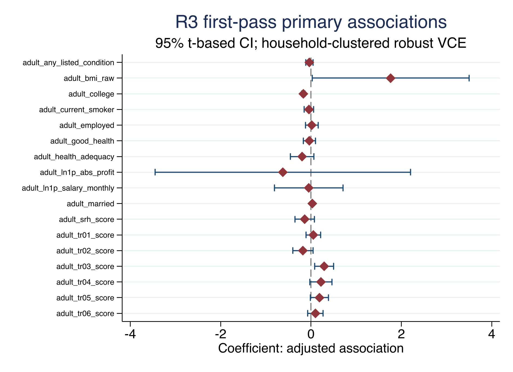
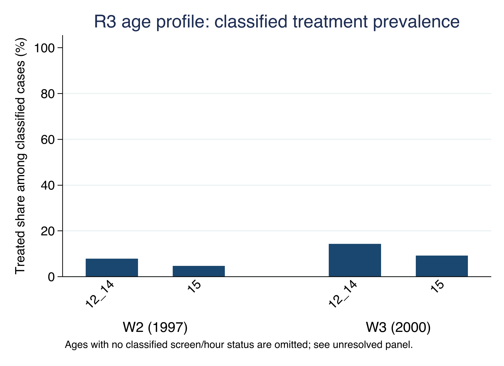

# Child Labor and Adult Outcomes in Indonesia: A First-Pass Analysis of IFLS

*Anonymised working-paper draft — Riset 3 first-pass release*

## Abstract

This paper examines the association between intensive market child labor at
age 15 and adult outcomes in Indonesia. The exposure is defined from observed
work screens and valid hours for up to two jobs in the second and third IFLS
waves. The primary treatment is more than 43 hours of market work in the
reference week. Younger age bands remain descriptive because their linked
work-screen support is sparse or unresolved. The W2/W3 age-15 treatment file
contains 1,131 eligible person-wave observations, including 71 treated and
1,060 controls before the W5-linked analysis frame. The common first-pass
frame contains 753 observations, including 44 treated and 709 controls. We
estimate unweighted adjusted associations with baseline controls, a wave
indicator, and treatment-wave household-clustered robust standard errors. The
largest signals are lower college attainment and higher marriage/cohabitation
and trust-item-3 scores among treated observations. These are conditional
associations, not causal effects. Attrition, small treated support, outcome
missingness, and limited work-label documentation constrain interpretation.

**Keywords:** child labor; adult outcomes; education; health; Indonesia;
longitudinal survey; social welfare

## 1. Introduction

Child labor may affect later education, employment, health, and social
outcomes. A longitudinal design can connect an observed work episode during
childhood to later outcomes, but it does not by itself solve selection into
work. Children who work long hours may differ in household resources, school
access, local labour demand, health, and expectations before the work episode.

This paper asks a bounded first-pass question: among IFLS children observed at
age 15 in W2 or W3, how is intensive market work in the reference week
associated with separate W5 adult outcomes? The paper focuses on transparent
measurement and support rather than presenting a causal estimate. It uses a
predeclared age-15 treatment because the age-10–14 data do not provide enough
resolved, comparable work-hour support for primary inference.

The analysis also keeps the outcome families separate. Education, labour,
health, and social/behavioural outcomes are not combined into a new index, and
the earnings results are not converted into a national loss or present-value
calculation. Those extensions require separate data and identification gates.

## 2. Data and study population

The IFLS is an ongoing longitudinal survey with repeated waves and information
at individual, household, community, and facility levels. RAND's official
study-design and data-notes pages document the wave structure, record units,
tracking guidance, skip patterns, and special codes; the IFLS5 field report
provides fieldwork and documentation context (RAND, 2016; RAND, n.d.-a;
RAND, n.d.-b; RAND, n.d.-c). RAND's access page requires registration for
public-use data, separates restricted-use access, prohibits redistribution, and
requires acknowledgement of IFLS (RAND, n.d.-d). This project uses locally
held IFLS files and preserves the raw source folder. The exact official
source-release identifier and owner access record remain open and are not
inferred from local hashes.

The treatment unit is a person-wave observation from W2 (1997) or W3 (2000).
The primary treatment population is restricted to persons aged exactly 15 at
the treatment wave, with a valid person and household link, an observed work
screen, and a W1 baseline linkage. W2 and W3 are pooled only with a wave
indicator, and standard errors are clustered at the treatment-wave household.

The age-15 treatment construction has 1,891 person-wave observations across
W2 and W3, of which 1,135 have an observed screen and 1,131 pass the primary
eligibility rules. The construction file contains 71 treated and 1,060
controls. After the W1 and W5 common-frame restrictions, the analysis sample
contains 753 observations: 44 treated and 709 controls.

### Table 1. R3 sample flow and support

| Stage | N |
|---|---:|
| Age-15 person-wave observations in W2/W3 | 1,891 |
| Observed work screen | 1,135 |
| Primary-eligible age-15 observations | 1,131 |
| Treated / control before common-frame restriction | 71 / 1,060 |
| W1-plus-W5 common analysis frame | 753 |
| Treated / control in common analysis frame | 44 / 709 |

These are construction and analysis-frame counts, not national child-labor
prevalence estimates.

## 3. Exposure, outcomes, and empirical specification

### 3.1 Treatment definition

The market-work screen is positive when the relevant activity evidence meets
the locked numeric rule. Job 1 hours are valid only when the job-1 status is
observed and hours are between 0 and 168. Job 2 is either explicitly absent or
has a valid status and hours in the same range. Total weekly hours are job 1
hours plus job 2 hours when a second job is present. The primary treatment is:

\[
T_i = 1\{\text{valid market-work screen and total hours} > 43\}.
\]

The screen uses the observed activity indicators documented in the treatment
definition. A person is a control only when the screen and hours provide
adequate evidence that the primary threshold is not met. Missing screens,
unknown activity codes, invalid hours, and unresolved second-job status are
kept as unresolved and are not forced into control.

The primary does not include chores, domestic work, hazardous work, or an
occupation/industry hazard classification. The age-10–11 and age-12–14
thresholds are retained only for descriptive/feasibility outputs. In the
working extraction, age-10–11 screen support is unresolved and age-12–14
treated counts are very small, so neither band is promoted to inferential
primary status.

### 3.2 Adult outcomes

The W5 outcome universe contains persons aged 17–36. The headline outcomes
are college attainment, employment, log monthly salary, self-rated health
score, good self-rated health, married/cohabiting status, and trust-item-3
score. Binary coefficients are percentage-point associations. Salary is
`ln(1 + salary)` within W5. An absolute-profit outcome is retained in the full
output but is not a headline claim because its model has only 11 treated
observations. No PCE deflation, NPV, or national aggregation is reported.

### 3.3 Model

For each valid W5 outcome (Y_i), the first-pass specification is:

\[
Y_i = \alpha + \beta T_i + \gamma'X_i + \delta Wave_i + \varepsilon_i,
\]

where (X_i) contains W1 age, child sex, household size, and linked parent
ages. `Wave` distinguishes W2 from W3. The model is unweighted, uses
treatment-wave household-clustered robust standard errors, and applies
outcome-specific listwise deletion. Benjamini–Hochberg q-values are calculated
within each predeclared paper-by-family group.

The coefficient β is an adjusted association. It does not identify the
causal effect of child labor because the observed treatment is not randomly
assigned and the current release has no valid instrument, fixed-effects design,
or attrition correction.

## 4. Results

### 4.1 Headline estimates

Table 2 is a pre-labelled domain table. It includes the same selected domains
for both papers and is not filtered after seeing the p-values. The complete
adjusted results file contains all outcome-family rows.

\newpage

### Table 2. R3 adjusted associations in the common first-pass frame

| Outcome | Estimate | 95% CI | p; BH q | N / treated |
|---|---:|---:|---:|---:|
| College attainment (pp) | -16.95 | [-20.57, -13.32] | <0.001; <0.001 | 719 / 43 |
| Employment (pp) | 1.77 | [-12.40, 15.95] | 0.806; 0.896 | 725 / 43 |
| Log monthly salary | -0.051 | [-0.812, 0.711] | 0.896; 0.896 | 342 / 17 |
| Self-rated health score | -0.141 | [-0.354, 0.073] | 0.197; 0.263 | 721 / 42 |
| Good self-rated health (pp) | -3.74 | [-17.18, 9.71] | 0.586; 0.586 | 721 / 42 |
| Married/cohabiting (pp) | 3.00 | [0.97, 5.03] | 0.004; 0.029 | 623 / 39 |
| Trust item 3 score | 0.292 | [0.082, 0.502] | 0.006; 0.029 | 704 / 39 |

The adjusted association with college attainment is -0.169, or about 17.0
percentage points, with a BH q-value below 0.001. The adjusted associations
with married/cohabiting status and trust-item-3 score are positive, with q =
0.029 for each. These patterns are conditional associations within the
selected sample and should not be read as effects caused by child labor.

Employment, salary, self-rated health, and good self-rated health do not have
headline q-values below 0.05. Salary is estimated on a much smaller sample
than the binary and health outcomes. In the full output, the absolute-profit
model has N = 168 and 11 treated observations; it is retained for auditability
but is not used to claim a monetary consequence.

### 4.2 Wave and age-band support

The treatment prevalence diagnostic records 35 treated and 705 controls among
age-15 W2 observations, and 36 treated and 355 controls among age-15 W3
observations before the common-frame restrictions. It also records unresolved
work screens and hours. The younger age bands do not have comparable support:
age-10–11 observations are unresolved in the working extraction, while
age-12–14 treated observations are sparse. These counts motivate the locked
age-15 primary rather than a broad age-band treatment.

## 5. Limitations and reviewer-facing boundaries

The first limitation is selection into work. The age-15 treatment is based on
work activity and hours in one reference week. It may proxy household poverty,
school access, local labour demand, health, preferences, and other factors
that also predict adult outcomes. W1 controls reduce measured differences but
do not establish exchangeability.

The second limitation is support. There are 44 treated observations in the
common frame, and outcome-specific treated counts range from 17 to 43 for the
headline results. A few households can materially affect the estimates. The
wave indicator and household clustering address a defined part of the data
structure; they do not solve the small-cell or identification problem.

The third limitation is attrition and missingness. The common frame requires
W1 linkage, W5 follow-up, and a valid value for each outcome. The outcome model
therefore has its own sample. Attrition correction and inverse-probability
sensitivity are parked, so the estimates should not be described as
population-average adult effects.

The fourth limitation is measurement. The current primary screen measures
market work and weekly hours. It does not establish hazardous work, chores,
domestic labour, occupation-specific risk, or a complete measure of mental
health. W3 value-label support is also limited for some work-screen variables;
the numeric rule is retained as a documented constraint rather than treated as
more informative than the source permits.

The fifth limitation is extrapolation. The current release does not have a
closed PCE/price-index bridge or a declared earnings projection. Consequently
it reports no NPV, national productivity loss, or policy-cost estimate.

## 6. Conclusion

In the locked first-pass IFLS frame, intensive market work at age 15 is
associated with lower adult college attainment and higher adult
marriage/cohabitation and trust-item-3 scores after adjustment for measured
baseline controls and treatment wave. Other headline outcomes do not show
family-level q-values below 0.05. The findings are bounded associations in a
selected longitudinal sample, not causal effects. Before a stronger journal
claim is made, the project needs an explicit attrition strategy, verified
survey design, completed source-release provenance, and an identification
design that can support causal interpretation.

## Declarations for author completion

**Data availability.** The project does not redistribute IFLS microdata. The
code, aggregate tables, figures, diagnostics, and reproducibility instructions
are local artifacts. Authors should obtain and cite the authorized IFLS files
through the official RAND documentation and comply with the applicable access
terms.

**Funding, conflicts of interest, ethics, acknowledgements, and author
contributions.** To be completed by the authors. No author metadata or
institutional statement is inferred from the supplied files.

**AI use statement.** AI-assisted drafting and organization were used during
the 5 September 2026 preparation of this internal draft. All reported
estimates were generated by the project's Stata do-files and checked against
the saved aggregate CSV files and logs. AI did not modify the raw or derived
IFLS data, and restricted microdata and credentials were not disclosed in the
drafting process. The authors remain responsible for the final manuscript and
for adapting this statement to the target journal's policy.

## References

RAND Corporation. (2016). *The Fifth Wave of the Indonesia Family Life
Survey: Overview and Field Report*. WR-1143/1-NIA/NICHD.
https://www.rand.org/content/dam/rand/pubs/working_papers/WR1100/WR1143z1/RAND_WR1143z1.pdf

RAND Corporation. (n.d.-a). *Indonesia Family Life Survey*.
https://www.rand.org/health/surveys/FLS/IFLS.html

RAND Corporation. (n.d.-b). *The IFLS Study Design*.
https://www.rand.org/health/surveys/FLS/IFLS/study.html

RAND Corporation. (n.d.-c). *IFLS Data Updates, Data Notes, Tips, and FAQs*.
https://www.rand.org/health/surveys/FLS/IFLS/datanotes.html

RAND Corporation. (n.d.-d). *Register to Download Indonesian Family Life
Survey (IFLS) Data*.
https://www.rand.org/health/surveys/FLS/IFLS/access.html
